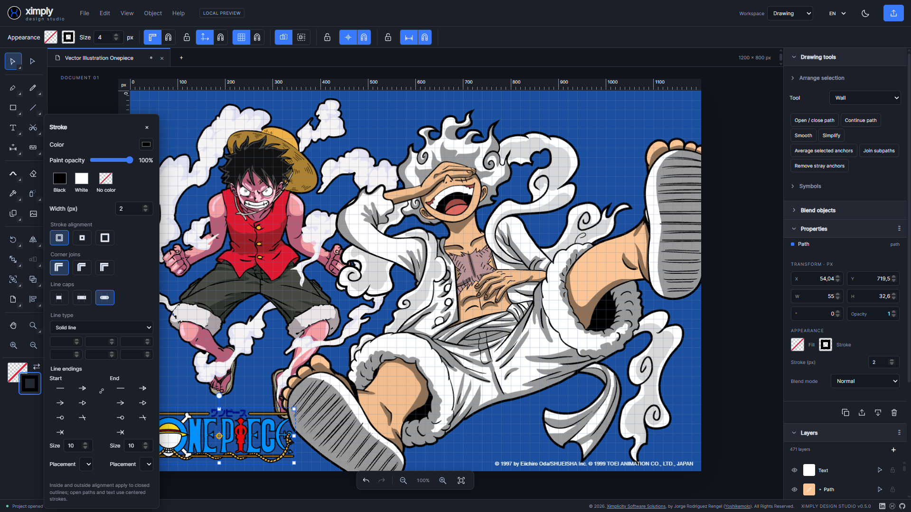

# ximply-design-studio

A layered vector and image editor by Ximplicity.

**0.9.0 — single-user drawing workbench preview.** Work on several documents in tabs, on a desktop or a phone, set
the page up from paper, screen and animation formats, import SVG, DXF, Illustrator, PDF and
EPS drawings as editable paths, draw floor plans with connected walls, openings, stairs and
drafting dimensions, draw and edit Bezier paths with the Pen, the Pencil and a vector
Paintbrush that behave as Illustrator's do, with its cursor marks, modifiers, fidelity and
smoothness, join, average, simplify and reshape paths, fill with gradients and patterns
from a Swatches panel in the colour model you work in, paint with gradient meshes, lock and
hide objects, scale, shear, distort freely, in perspective, with the liquify tools or
through envelopes, cut them with the scissors and the knife, paint with brush tips and their
own control bar, trace images, reuse symbols, edit text inline and turn it into shapes, copy
and paste with stacked pastes, repeat and duplicate transformations about a movable pivot,
zoom as Illustrator does, with Pixel Preview and a sharp redraw of a magnified page, retouch
images and save editable .xds projects, under another name with Save As, or PNG, SVG and PDF
output, printing included. The architecture for the broader professional platform
remains documented; this preview implements a bounded first slice and has not passed the
strict quality gate.

## Try it online

### [Open the live preview at xds.ximplicity.es](https://xds.ximplicity.es)

[](https://xds.ximplicity.es)

The preview above is the editor running in a browser: the drawing tools on the left, the
appearance of the selected path in the middle, and the properties and layers of the
document on the right. It is served as static files with no account and no server
storage, so drawings live in the browser and in the files you save. It is a preview of
the work on the release branch, not a released product, and carries no quality-gate
evidence.

## Quick Start

Requirements: Git, Docker Desktop/Engine with Compose v2, and Python 3.11+.

```bash
git clone https://github.com/Yoshikemolo/ximply-design-studio.git
cd ximply-design-studio
./scripts/local.sh start
```

On Windows, run `./scripts/local.ps1 start`. Open **http://localhost:8090**.
The launcher creates a private local environment file and publishes only on loopback.
Drawing and local project-file save/open do not require server authentication.

[quick-install.md](quick-install.md) contains setup, server-storage authentication,
keyboard shortcuts, cleanup and development commands.
[trouble-shooting.md](trouble-shooting.md) covers common failures.

## Included in the preview

- Several documents in tabs, File > Clear, Save and Save As, with local recovery per tab.
- Cubic Pen, Pencil, vector Paintbrush, Smooth, Path Eraser, direct anchor editing,
  construction primitives and path refinement, with Illustrator's modifiers and cursor marks.
- Multiple selection, contextual grouping/regrouping, alignment/distribution and vector boolean operations.
- Linear, angular, chain, radius and diameter dimensions with editable units, labels and endpoint markers.
- Parametric 2D walls, hosted doors/windows with their leaf mechanisms, stairs and rectangular or circular pillars.
- Bounded scanline image tracing and local linked symbols with painting tools.
- Inline editable text and text converted to outlines with Ctrl+Shift+O.
- Layer selection, movement, corner/edge resizing, rotation handles, ordering, visibility, locks,
  opacity and blend modes, with Illustrator's Lock and Hide commands.
- Rotate, Reflect, Scale, Shear, Reshape and Free Transform tools, the Scale, Shear and
  Transform Each dialogs, Transform Again and duplication in series about a movable pivot.
- The seven liquify tools, envelopes made with a warp, a mesh or a top object, and
  gradient meshes made with the Mesh tool (U) or Object > Create Gradient Mesh.
- Fills with colours, linear and radial gradients and patterns, a Gradient tool, a
  Swatches panel and Quick RGB, RGB, CMYK, greyscale and custom colour models.
- PNG/JPEG/WebP import, raster brush tips, a paint layer cropped to what was painted,
  eraser and non-destructive image adjustments.
- SVG, DXF, PDF, EPS and PDF-compatible Illustrator import as editable paths.
- Undo/redo, native .xds save/open, PNG, supported-vector SVG and vector PDF export, and printing.
- Page setup, rulers with major and minor marks, guides, grid, independent snapping,
  Zoom and Hand tools as in Illustrator, outline view and Pixel Preview.
- Configurable collision-checked shortcuts, Shift angle constraints and tool cursor badge.
- Dark/light themes, EN/ES interface labels, View > Layout toggles for the tools, panels,
  context bar and document tabs, with hidden columns reachable as drawers from an edge
  handle, and a phone layout with drawers and a menu button.
- Three.js layer-plane inspection with camera orbit, zoom and pan.
- About screen with the licence name and SHA-256, a version selector and bundled Markdown
  release notes.
- Bearer-protected FastAPI artifact storage for one local user.
- Advanced mode with a local Keycloak: sign-in with PKCE, time-limited licences with tiers
  (Free, Pro, Teams, Studio and Enterprise, all equal for now), a Demo or tier badge after the
  logo, and an administration workspace for users, roles and permissions, licences and
  documents, with bulk actions and typed filters. The online preview has no Keycloak and runs
  in demo mode.
- Convert to pixel image, the advanced tools block, the Properties, AI Tools and History tabs
  and each user's own OpenAI API token in Settings > External tokens; the AI Tools and History
  panels are still being built.
- Copies, duplicates and converted pictures leave the groups their originals were only members
  of, as in Illustrator; Paste in Front and Paste in Back at a group member join its group.

Native saves use format 2; preserve original v1 files because older readers cannot
open new saves, and a project that uses a newer field, such as an envelope, a gradient
mesh or a paint layer, is refused by earlier versions. Tracing is capped at 64 pixels
per side; curved vector erasure is sampled. Nonuniform group scaling preserves rotated child geometry through centered shear.
Nine-slice insets are fixed; registration/slice-guide editing and full
graphic styles remain pending. See the [drawing roadmap](doc/planning/drawing-roadmap.md).

Dimension anchors are independent annotations, not persistent CAD constraints.
Procedural floor plans are bounded 2D vector geometry, without BIM or structural validation.

Start the local stack with `./scripts/local.ps1 start --identity` for advanced mode and
`./scripts/live.ps1` for a live preview with hot reload at http://localhost:8090.

The preview does not implement a production Keycloak deployment, PostgreSQL/TypeORM
transactions, multiuser collaboration, desktop windows, third-party plugin loading,
CSG modeling, advanced selection masks, animation or PSD/Illustrator native fidelity.
The local file repository is an artifact adapter, not a replacement for the planned
transactional persistence service. Do not expose this preview as a production service.

## Engineering and documentation

- [Documentation entry map](doc/INDEX.md) and [agent rules](AGENTS.md)
- [Functional specification](doc/product/functional-specification.md)
- [Proposed architecture](doc/architecture/system-overview.md) and [ADRs](doc/adr/INDEX.md)
- [First editor scope and evidence](doc/implementation/PLAN-0002-0001.md)
- [Drawing iteration and acceptance](doc/implementation/PLAN-0008-0001.md)
- [Methodology audit](doc/testing/methodology-audit.md)
- [Contribution rules](CONTRIBUTING.md) and [GitFlow](doc/engineering/gitflow.md)
- [Changelog](CHANGELOG.md) and [release-note contract](doc/product/footer-and-changelog.md)

The source of truth for current version is `release/version.json`. Release notes are
Markdown under `doc/changelog`; bundled data is generated. Credentials, dependencies,
build outputs and local project files are not committed.

## Local validation

```bash
npm ci --ignore-scripts
npm run build
npm test
python3 harness/context.py --check
python3 harness/knowledge.py
python3 harness/changelog.py --check
python3 harness/check_docs.py
python3 -m unittest discover -s tests -v
```

API tests require `services/api/requirements-dev.txt`, then
`python -m pytest services/api/tests -q`.

The earlier local preview has [recorded container evidence](https://github.com/Yoshikemolo/ximply-design-studio/actions/runs/35444283893).
That historical run does not validate this drawing iteration. Record current revision
build/test/CI evidence in the [drawing plan](doc/implementation/PLAN-0008-0001.md).
Visual browser acceptance, the strict SonarQube gate, protection verification and
independent human review remain required before merging. Feature-branch availability
allows local evaluation; it is not full product certification.

## Licence

This software is published under the [Ximply Design Studio Limited Use Licence](LICENSE),
a proprietary licence. You may read it and run it to evaluate it, to study it or for your
own internal use. Distributing it, building anything derived from it and any commercial
use need the written permission of the author. The repository being public is not a grant
of those rights. Third-party material keeps its own licence, and a drawing shown in a
screenshot belongs to whoever owns it. See [LICENSE-DECISION.md](LICENSE-DECISION.md).
Owner and reviewer: Yoshikemolo.
