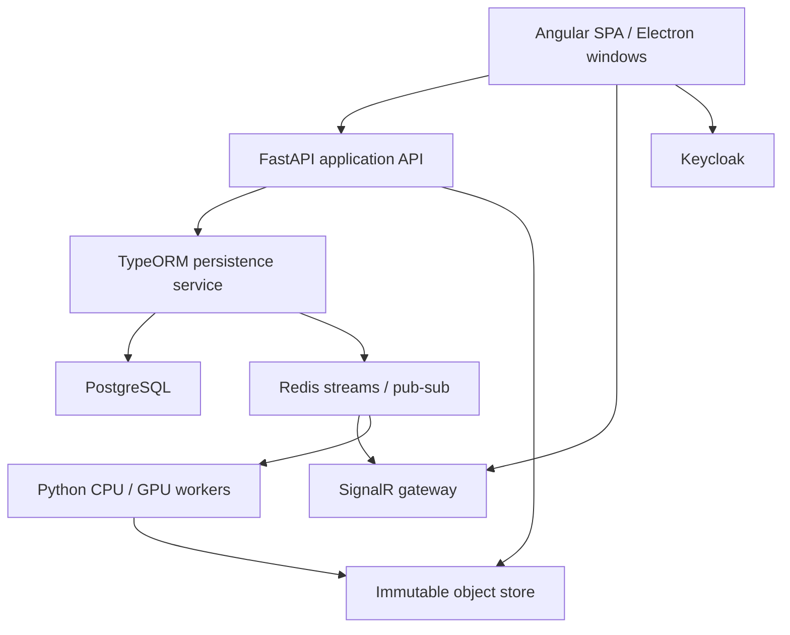

# System architecture

Status: Proposed. Constraints: Angular + TypeScript, FastAPI + Python, PostgreSQL +
TypeORM, Redis, SignalR, Keycloak. The mixed runtime topology is intentional and
must be human-reviewed in ADR-0002 and ADR-0003 before production implementation.

## Layering and patterns

| Layer | Responsibility | Dependency rule |
| --- | --- | --- |
| Domain | Typed documents, value objects, invariants, commands, pure reducers | No Angular, Three.js, ORM, HTTP or GPU imports |
| Application | Use cases, policy, orchestration, unit-of-work ports | Depends on domain and ports |
| Adapters | HTTP, TypeORM, Redis, GPU, file codecs, SignalR | Implements ports; no bypass to UI state |
| Presentation | Angular facades, signals, components, accessibility | Talks to application facades; no SQL or raw transport |
| Composition | DI, plugin activation, configuration | Chooses mock/real adapters explicitly |

Command + handler captures edits; Composite represents groups and layout trees;
Strategy selects rendering, brush, codec and compute kernels; Factory/Abstract
Factory instantiates compatible plugin resources; Adapter wraps transport/host APIs;
Facade hides application workflows; Repository and Unit of Work own persistence;
Decorator adds policy/telemetry/validation around handlers. Apply patterns where
there is an actual variation or boundary, not a generic abstraction per class.

## Runtime responsibilities

**Angular.** Standalone components, strict templates/TypeScript, zoneless-compatible
reactivity, typed reactive forms, lazy tool bundles, OnPush boundaries and derived
computed values. `EditorFacade`, `WorkspaceFacade`, `AssetFacade`, `SessionFacade`,
`PluginFacade` and `CollaborationFacade` expose readonly signals and explicit
commands. Injection tokens bind Mock and Remote ports. Mock mode is a separate
explicit development configuration, visibly marked; it must not bypass production
authorization or claim a remote save.

**FastAPI.** Validates public requests, identity, project policy, command schemas,
import/export plans and job orchestration. Uses async I/O with bounded timeouts and
connection pools. Heavy processing never runs on the request event loop. Python
has repository Protocols implemented by a private HTTP adapter to TypeORM; it has
no competing ORM or schema migrations. REST entry points use FastAPI decorators;
policy and tracing use dependencies/middleware with preserved signatures.

**Persistence.** A small TypeScript service owns repositories, domain mutation
preconditions, durable revisions, idempotency, membership checks and an outbox in
one PostgreSQL transaction. It rechecks authority immediately before commit. It
must not trust a caller-supplied tenant/user header. Service authentication plus
short-lived signed on-behalf-of assertions binds user, audience, project, policy
version and operation digest. The API cannot fabricate arbitrary project access.

**Realtime.** ASP.NET Core SignalR authenticates JWTs and per-project subscriptions,
delivers authoritative events, rate-limits presence and disconnects revoked users.
No ORM writes or business rules duplicated in hubs. Browser mutation commands go
to FastAPI; presence/view updates use hub methods. The gateway's outbound notifier
consumes outbox events via Redis; hub scale-out uses the supported Redis backplane.
Each broadcast is emitted once logically with event-ID deduplication, avoiding a
consumer on every instance republishing the same event to every instance.

**Workers.** Python processes run image/geometry/export/AI jobs from recoverable
streams. CPU kernels use native libraries, threads where GIL is released, or
process pools for Python CPU work. GPU processes initialize after spawning, with
one owning process per assigned device and explicit VRAM quotas. No CUDA contexts
are forked from API processes. CUDA, Metal or other accelerators are adapters and
capability-tested; CPU fallback reports latency/precision differences. Backend GPU
and browser GPU are independent capabilities.

## Storage and transaction boundary

PostgreSQL is the durable authority. Redis is a fast cache, presence transport and
queue; neither memory stores nor SignalR is the ledger. Binaries live in a local
content-addressed store for development, S3-compatible storage for shared use.
An uploaded temporary blob is hash-verified, registered and referenced in a committed
revision; unreferenced uploads are collected only after a grace period. Database
transactions never stream full images. Signed blob URLs are short-lived and scoped.
Authorization is rechecked before issuing or renewing them.

## Deployment and operations

Start with one instance of each application service, one worker and one database;
scale by evidence. Separate networks for edge, application and stateful services.
Only edge HTTPS is externally exposed in production. Keycloak, database, Redis,
object store and SonarQube administration are not public application endpoints.
Health distinguishes process live, service ready and dependent-service degraded.
OpenTelemetry traces connect REST, outbox, jobs and delivery via correlation IDs.
Use structured logs without access tokens, image pixels, raw prompts or document
content. Graceful shutdown drains requests and relinquishes job leases safely.
